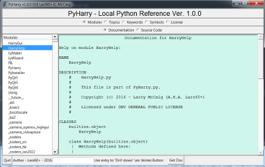
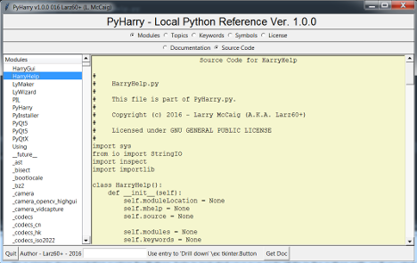

# PyHarry
Python Local Reference - 'Harry the helper'

Here's the first release of something I call PyHarry - Harry, Someone always ready to help!

Screenshots:

Documentation Screen:

Source Code Screen:

It's a simple documentation system for Python, help is included your own code (if it's in the
python path, or if you start it up in your working directory).

If you import new packages into your system, they will show up in the menus.

Code was written on windows 7, using python 3.5, should work elsewhere with minor changes, and
I will make it multi-platform ASAP - If anyone else would like to do this, be my guest!

I have released it under the GNU GENERAL PUBLIC LICENSE.

The following modules are required to run:

tkinter
tkinter.ttk
importlib
inspect
io
sys

Running the program is pretty simple, the categories are all selected with the set of radio buttons
under the title, and are broken down as follows:

Modules - like tkinter
Topics - like CALLABLEMETHODS
Keywords like True, False and lambda
and Symbols like %=

Below that, you can change the display by clicking on the documentation or source code
radio buttons.

I have kept the text windows editable so that you can cut and paste what you'd like to copy,
and add notes if you so wish (nothing is saved to disk, so not to worry)

I change the text windows by switching the stacking order using lift and lower.
That code is a bit interesting.

Hope you find it useful.

Larry McCaig - Larz60+
